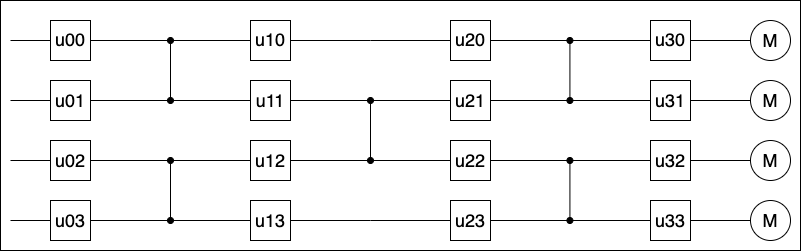
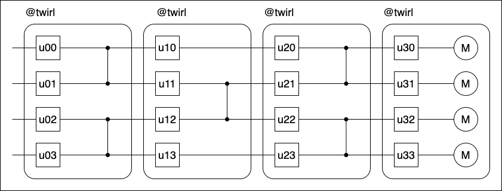
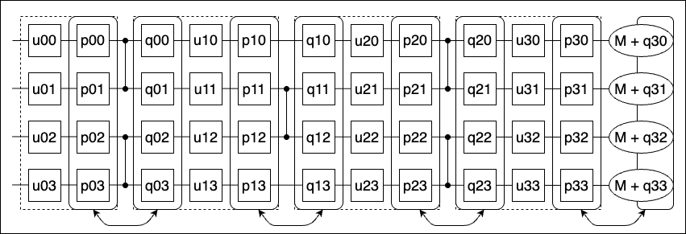
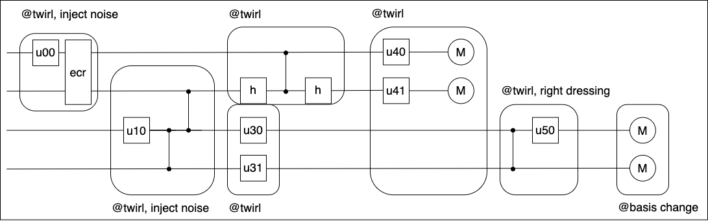
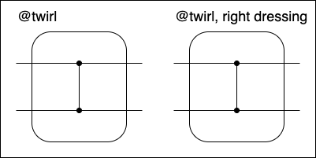
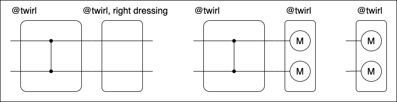
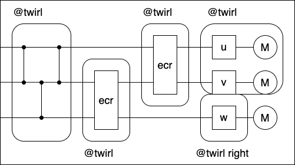

Dressed boxes
=============

Physical noise mechanisms that occur during the execution of quantum circuits are contextual.
When applying operations on disjointed qubits simultaneously, the noise profile of the overall operation might differ from the noise profiles of the constituent parts if they were applied in isolation.
Similarly, for operations that ideally commute on the same qubits, the noise profile associated with the individual operations might not commute and could be different altogether if the order of the operations changed.
Therefore, protocols for suppressing, mitigating, and correcting noise need to know the context in which it arises.

Samplomatic uses box instructions to reason about collections of circuit operations that should be treated as having a stable noise context, and uses annotations on boxes to allow users to declare and configure that intent.
Every box is a scope that owns a set of qubits, operations that act on those qubits, and a list of annotations.
Samplomatic annotations specify *directives* and *dressings*.
Directives specify what to do with the box, for example, twirl the box.
Dressings are groups of parameterized gates to add to the left- or right-side of the box, for example, a layer of single qubit gates.
The gates in a dressing incorporate gates from the box and operations required to enact directives, such as the following:

* Gates in the box that are compatible with and are on the same side as the parameterized gates.
* Twirling gates sampled from a set to randomize the box.
* Noise injection gates sampled from a Pauli Lindblad map.
* User-specified basis changing gates.

Note that directives can alter dressings of other boxes.

Example
-------

Suppose we want to twirl the following circuit, adding random Pauli gates before and after the parallel entangling gates that don't change the logical content of the circuit, but that do change the effective noise model.

    Circuit to Pauli twirl.

This is achieved by stratifying the circuit into boxes and adding twirl annotations.

    Circuit with Pauli twirling directives.
    The ``@`` symbol is used to specify directives, dressing by default is on the left.

Each dressed box contains a layer of single-qubit gates and a layer of two-qubit entangling gates on disjoint pairs of qubits.
The layer of entangling gates is surrounded by layers of random Pauli gates in such a way that the box's logical action is unchanged.
These random Pauli layers are *virtual* in the same way as a virtual Z gate. They do not add  operations to the circuit, but instead act as a directive to alter how adjacent single-qubit gates are implemented.

    Circuit with dressings and gates from directives.
    Dressings are the dashed boxes.
    Pauli layers attached by arrows cancel each other out.
    The final Pauli layer will be applied as bit flips to the measurement outcomes.

The random Pauli layer between the entangling gates and single-qubit gates is composed into the layer of single-qubit gates and is implemented in its dressing.
The other random Pauli layer will be composed into the dressing of the next dressed box.

To summarize, the left (or right) twirl directive implements a random Pauli in this box's dressing and applies the Pauli that undoes it in the next (or xzprevious) box's dressing.
The inject noise and basis change directives are analogous.

Circuit randomization with virtual gates
----------------------------------------

Samplomatic uses the framework of *virtual gates* to reason about circuits with dressed boxes.
Conceptually, and as implemented in a :class:`~.Samplex` instance produced by the :func:`~build` process, virtual gates are generated at the boundary of the box opposite its dressing.
These virtual gates are moved through the circuit in a prescribed way and need to be composed into a dressing.
If all virtual gates can be composed into a dressing, randomizations of the circuit can be built procedurally.

    Circuit with twirl, basis change, and inject noise directives.

Gates on the side of the dressing that are compatible with the dressin's template parametrization can be composed into it, reducing the number of physical gates.
These are called *easy* gates.
The remainder of the box is called *hard* and is implemented as is.

    Examples of circuits with hanging virtual gates.
    The virtual gates on the opposite side of the dressing have nowhere to be implemented.

    Examples of circuits where all virtual gates are composed into dressings.
    Measurements have Pauli gates added in by accounting for the bitflip they induce.

    Complex example where all virtual gates are collected.
    Virtual gates generated by one box can be composed into different dressings.

This allows for constructions where dressed boxes do not need to have the same width.
