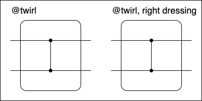

Dressed boxes
=============

Physical noise mechanisms that occur during the execution of quantum circuits are contextual.
When applying operations on disjoint qubits simultaneously, the noise profile of the overall operation may not be equal to that of the constituent parts if they were to be applied in isolation.
Similarly, for operations that ideally commute on the same qubits, the noise profile associated with the individual operations may not commute and could be different altogether if the order of the operations changed.
Further, different operations within the same circuit may require altogether different techniques to reign in their errors.
Protocols for suppressing, mitigating, and correcting noise therefore need to know the context in which it arises.
Samplomatic uses annotated boxes to capture and control these noise contexts transparently.

Every box is a scope that owns a set of qubits and operations that act on those qubits, and a list of annotations.
Samplomatic annotations specify *dressings* and a *directives*.
A dressing is a group of parameterized gates to add to the left- or right-side of the box.
It also incorporates compatible gates on the same side from the box.
A directive specifies what to do with the box.
This could be to randomize its content (via twirling or noise injection) or to perform user-specified unitary transformations (for example, a change of basis), and is accomplished by choosing the parameters of the box's dressing and adjacent dressings accordingly.

A guiding example
-----------------

Consider Pauli twirling a static circuit.

.. figure:: ../figs/undressed_pauli.drawio.png

    Circuit to Pauli twirl.

The circuit can be stratified into boxes.

.. figure:: ../figs/dressed_pauli_twirl.drawio.png

    Circuit with Pauli twirling directives.
    The ``@`` symbol is used to specify directives, dressing by default on the left.

Each dressed box contains a layer of single-qubit gates and a layer of two-qubit entangling gates on disjoint pairs of qubits.
When interpreted, the layer of entangling gates is surrounded by layers of random Paulis in such a way that the logical action of the box is unchanged.

    Circuit with dressings and gates from directives.
    Dressings are the dashed boxes.
    Pauli layers attached by arrows cancel each other out.
    The final Pauli layer will be applied as bit flips to the measurement outcomes.

The random Pauli layer between the entangling gates and single-qubit gates is composed into the layer of single-qubit gates and implemented together in its dressing.
The other random Pauli layer will be composed into the dressing of the next dressed box.
The random Pauli gates are *virtual* in the same spirit as a virtual Z gate–they do not add additional operations to the circuit, but instead act as a directive to alter how other operations are implemented.
Recast in this light, the left (right) twirl directive is to implement a random Pauli in this box's dressing and apply the Pauli that undoes it in the next (previous) box's dressing.

Composing dressed boxes
-----------------------

.. figure:: ../figs/dressed_box.drawio.png

    Circuit with twirl, basis change, and inject noise directives.

Gates on the side of the dressing compatible with its template parametrization can be composed into it, reducing the number of physical gates.
These are called easy gates.
The remainder of the box is called hard and is implemented as is.
Directives are enacted by *virtual gates* generated at the edge of the box opposite its dressing.
These virtual gates are moved through the circuit in a prescribed direction and need to be composed into a dressing.

    Examples of circuits with hanging virtual gates.
    The virtual gates on the opposite side of the dressing have nowhere to be implemented.

.. figure:: ../figs/dressed_box_collected.drawio.png

    Examples of circuits where all virtual gates are composed into dressings.
    Measurements have Pauli gates composed in by accounting for the bitflip they induce.

.. figure:: ../figs/dressed_box_mixed_collect.drawio.png

    Complex example where all virtual gates are collected.
    Virtual gates generated by one box can be composed into different dressings.

If each virtual gate can be composed into an adjoining dressing, the circuit can be converted to a template circuit and samplex.
This allows for constructions where dressed boxes do not need to have the same width.
