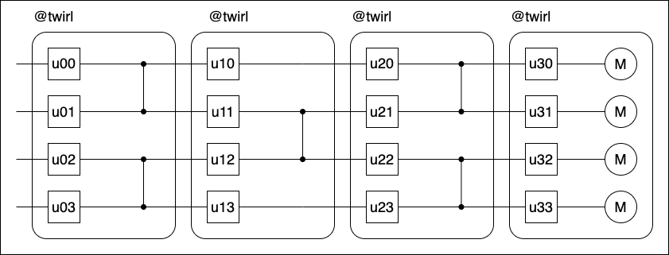
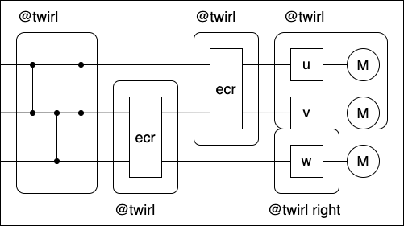

Dressed boxes
=============

Noise in physical quantum circuits is contextual.
When applying operations on disjoint qubits simultaneously, the noise profile of the overall operation may not be equal to that of the constituent parts.
Similarly, for operations that ideally commute on the same qubits, the noise profile associated with the individual operations may not commute and could be different altogether if the order of the operations changed.
Further, different operations within the same circuit may require altogether different techniques to reign in their errors.
Protocols for suppressing, mitigating, and correcting noise therefore need to know the context in which it arises.
Samplomatic uses dressed boxes and directives to capture and control these noise contexts transparently.

*Dressed boxes* are scopes that own a set of qubits, operations that act on them and a dressing.
The dressing is a collection of parameterized gates that are added to one side of the box.
*Directives* specify how to implement the contents of a dressed box–twirl the operations with a specific group, inject additional noise, or add basis changing gates.
This is done by varying the parameters of the dressings of a given box and its neighbors.

A guiding example
-----------------

Consider Pauli twirling a static circuit.

    Circuit to Pauli twirl.

The circuit can be stratified into boxes.

    Circuit with Pauli twirling directives.
    The ``@`` symbol is used to specify directives.

Each dressed box contains a layer of single-qubit gates and a layer of two-qubit entangling gates on disjoint pairs of qubits.
The layer of entangling gates is surrounded by layers of random Paulis in such a way that the logical action of the box is unchanged.
The random Pauli layer between the entangling gates and single-qubit gates is composed into the layer of single-qubit gates and implemented together in its dressing.
This is typically accomplished with standard matrix multiplication and then synthesizing the result.
The other random Pauli layer will be composed into the dressing of the next dressed box.
In this sense, the random Pauli gates are virtual in the same spirit as a virtual Z gate–they do not add additional operations to the circuit, but instead act as a directive to alter how other operations are implemented.

Directives owned by a dressed box will specify a dressing side and synthesizer.

    Circuit with twirl, basis change, and inject noise directives.

By default, the dressing is assumed to be on the left.
Any gate that is on the side of the dressing that can be implemented by the synthesizer will be composed into the dressing.
These gates are called the easy gates.
The remainder of the box is referred to as hard and will be implemented physically.
The directives also specify what virtual gates are generated by the box.
Virtual gates are moved through the circuit in a prescribed direction until they are collected in a dressing.

As long as each virtual gate is collected, the circuit is valid.

.. figure:: ../figs/dressed_box_uncollected.drawio.png

    Examples of circuits with uncollected virtual gates.
    The virtual gates on the opposite side of the dressing have nowhere to be implemented.

    Examples of boxes where all virtual gates are collected.
    The measurement outcome can collect virtual gates.

    Complex example where all virtual gates are collected.
    Virtual gates generated by one box can be collected by a number of different boxes.

This allows for constructions where dressed boxes do not need to have the same width.

Any virtual gate can be synthesized by a collector is collected.
This allows for mixing and matching different twirling strategies so long as they are compatible with the synthesizer.
